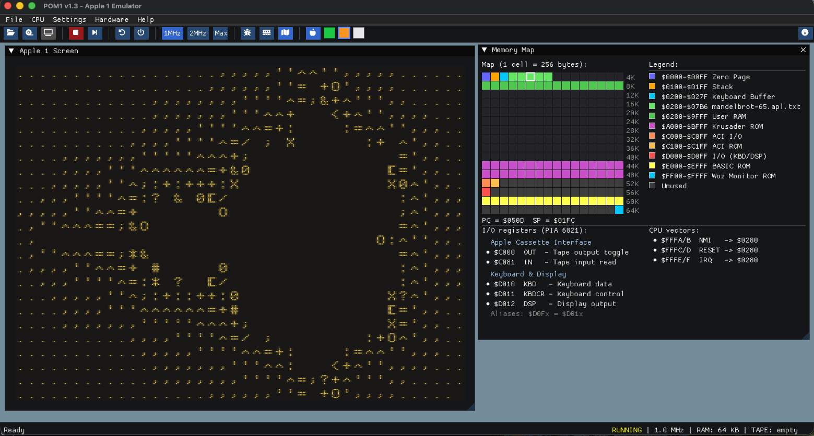

<div align="center">

# 🍎 POM1 v1.9.2 — Apple 1 Emulator

### *The 1976 personal computer revolution, faithfully reborn — with 50 years of expansion cards bolted on.*

🎂 **Celebrating 50 years of Apple (1976 → 2026)** with the most complete Apple 1 emulator ever shipped: 13 one-click machine presets, 16 expansion cards, 60+ ready-to-run programs, **cycle-accurate libresidfp SID engine** with hot-swappable 6581/8580 chips, and a 1976 SWTPC GT-6144 graphics card sitting next to a 2026 Wi-Fi modem & TMS9918 cartridge library.

Built with Dear ImGui & OpenGL — fast, lightweight, cross-platform.

[](https://habib256.github.io/POM1/build-wasm/POM1.html)

[](LICENSE)
[](#-quick-start)
[](#)
[](#%EF%B8%8F-machine-presets)
[](#-software-library)



</div>

---

## 🌟 Why POM1?

> *Every other Apple 1 emulator stops at the WOZ Monitor. POM1 keeps going for 50 years.*

- 🎵 **Real chiptune sound on a 1976 board.** Drop a `.sid` from the [HVSC archive](https://www.exotica.org.uk/wiki/High_Voltage_SID_Collection) onto `tools/sid2apple1.py`, swap between MOS 6581 and CSG 8580 *while it plays*, and hear genuine SID through libresidfp.
- 🎨 **Three independent graphics cards across half a century.** The 1976 SWTPC GT-6144 (with bistable SRAM noise on power-up), Uncle Bernie's GEN2 HGR (NTSC artifact colours), and the P-LAB TMS9918 (256×192 + 32 sprites + silicon-strict timing model documented in [`Programming_TMS9918.md`](sketchs/doc/Programming_TMS9918.md)).
- 📡 **Wi-Fi modem dialing real BBSes.** Flip on the P-LAB Wi-Fi card, type `ATDT bbs.fozztexx.com:23` in WOZ Monitor and you're on a 2026-era BBS. Or run `telnet localhost 6502` to drive the Apple 1 from any modern terminal.
- 💾 **Cartridge ecosystem unique to POM1.** The P-LAB CodeTank ships **3 ready-to-flip cartridges** (GAME1/GAME2/GAME3) covering arcade games, a dungeon crawler, a LOGO turtle interpreter and graphics demos — rebuilt from [`sketchs/`](sketchs/) + [`dev/projects/`](dev/projects/) sources via `python3 tools/build_codetank_rom.py`.
- 🔬 **Cycle-accurate down to the bus.** The SID, TMS9918, ACI cassette and modem all run on the same `POM1_CPU_CLOCK_HZ = 1 022 727` clock; tempo follows emulation speed, not wall-clock. Klaus Dormann's 6502 functional test pinned in CI.
- 🛠️ **A complete cc65 dev tree.** Shipped program sources live in [`sketchs/`](sketchs/) (DevBench sketches) and [`dev/projects/`](dev/projects/) (multi-file builds) — Galaga, Sokoban, Snake, Logo, Rogue, Tetris, Mandelbrot, Plasma, Connect-4 trilogy, two Sokoban trilogies, and more.
- ⌨️ **TTL-faithful keyboard** (no autorepeat by default, like the real ASCII keyboard ROM) — toggle to host autorepeat from *Settings* if you can't take it.

---

## ⚡ 60-second tour

Five things to try **right after first boot** (every preset boots into WOZ Monitor at `$FF00`). New to the Apple 1? Follow the guided **[`QUICKSTART.md`](QUICKSTART.md)** — your first program in 5 minutes.

```
0:F      ; Wozmon "examine" — read $0000 (PIA test)
F000R    ; cold-start whatever ROM is currently mapped at $F000
```

1. **Write your first BASIC program** → preset **#4**, type `E000R` (cold-start Integer BASIC), then `10 PRINT "HELLO WORLD"` and `RUN`. Welcome to 1976.
2. **Play the A1-SID piano** → preset **#12** (default — A1-SID plugged; or *Hardware → A1-SID* on any preset), *File → Load Memory* → `software/SOUND SID/Claudio_PARMIGIANI_SID_PIANO_ORIG.txt`, type `C400R`, then press keys to play. Real SID synthesis on Apple 1 hardware.
3. **Plug a TMS9918 cartridge** → preset **#9** (CodeTank), *File → P-LAB CodeTank Library* → `Codetank_GAME2.rom` → flip *upper jumper* → `4000R`. Mode-III Nyan Cat at 20 fps.
4. **BBS over real TCP** → preset **#12** (default — Wi-Fi Modem plugged; or *Hardware → Wi-Fi Modem* on any preset), `0280R` to load ATmodem, then `ATDT bbs.fozztexx.com:23`. Browse a 2026-era BBS in WOZ Monitor.
5. **Live debugging** → `F1` opens the memory viewer, `F7` single-steps the 6502, `F3` opens the BRK trace. Watch Microchess plan its move.

---

## ✨ Hardware

**Core machine** — Authentic 40×24 display (`charmap.rom` bitmap, three CRT phosphors, scanlines, glow), cycle-accurate **6502** (all official opcodes, ~1.022727 MHz / 2× / MAX), paste-code, step debugger, live memory editor + visual map, **13 one-click presets** (3 DevBench profiles + 10 machines) from *Bare Apple-1 (July 1976)* to *POM1 Multiplexing Fantasy (2026)*.

| Card | Year | Highlights |
|---|---:|---|
| 📼 **ACI cassette** | 1976 | `.aci`/`.wav`/`.mp3`/`.ogg`, procedural deck widget, smart jaquette via `tapeinfo.txt` |
| 🎨 **SWTPC GT-6144** | 1976 | First commercial Apple 1 graphics card. 64×96 mono, $98.50, demoed by Woz in *Interface Age*. Power-on bistable noise reseeds on every plug |
| 🖨️ **SWTPC PR-40** | 1976 | Steve Jobs' Oct-76 *Interface Age* mod — every char on `$D012` also prints on a 40-col matrix printer. Mixed/PrintOnly DPDT switch |
| 💾 **Briel Krusader** | 2003 | Vince Briel's monitor extension |
| 💾 **CFFA1** | 2007 | Rich Dreher's CompactFlash card. ProDOS `.po` images, ATA/IDE regs at `$AFE0` |
| 💾 **[P-LAB microSD](https://p-l4b.github.io/sdcard/)** | 2022 | Virtual FAT32 over 65C22+ATMEGA. SD CARD OS shell (`DIR`, `LOAD`, `CD`, fuzzy match) |
| 📼 **[P-LAB IEC daughterboard](https://p-l4b.github.io/iec/)** | 2026 | Commodore 1541 over SN7406 on microSD's spare VIA pins. `@DEV`/`@$`/`@L`/`@S` shell |
| 🎵 **[P-LAB A1-SID](https://p-l4b.github.io/A1-SID/)** | — | libresidfp 6581/8580, hot-swap chip model live, `.sid` converter |
| 🎵 **A1-AUDIO Special Edition** | — | Same chip relocated to `$CC00-$CC1F` (excludes TMS9918) |
| 🎨 **[Uncle Bernie's GEN2 HGR](https://www.applefritter.com/content/uncle-bernies-gen2-color-graphics-card-apple-1)** | 2026 | 280×192 Apple-II-style framebuffer with NTSC artifact colour |
| 🎨 **[P-LAB TMS9918](https://p-l4b.github.io/graphic/)** | — | TMS9918A VDP, 256×192, 32 sprites, 4 modes. Silicon-strict timing model |
| 💾 **P-LAB CodeTank** | — | Daughterboard of the TMS9918 card. **5 cartridges shipped** (see Software) |
| 💾 **[P-LAB Juke-Box](https://p-l4b.github.io/jukebox/)** | — | Paged 16 KB–512 KB flash + writable 28c256 EEPROM. `$CA00` bank latch |
| ⏰ **[P-LAB I/O Board & RTC](https://p-l4b.github.io/A1-IO_RTC/)** | — | DS3231, DS18B20, ADC + digital I/O |
| 📡 **[P-LAB Wi-Fi Modem](https://p-l4b.github.io/wifi/)** | — | 65C51 + ESP8266, Hayes AT, real TCP/TELNET (desktop only) |
| 🖥️ **[P-LAB Terminal Card](https://p-l4b.github.io/terminal/)** | — | TCP server on `:6502`, sniffs `$D012`, injects keys at `$D010`. ANSI-capable host terminals work as the Apple 1 console |

---

## 🚀 Quick Start

### 🐧 Linux / 🍏 macOS

```bash
git clone https://github.com/gistarcade/POM1.git
cd POM1
./setup_pom1.sh                    # fetch Dear ImGui + install deps (one-time)
cd build && cmake .. && make
cd .. && ./run_emulator.sh
```

### 🪟 Windows

Prereqs: [Visual Studio](https://visualstudio.microsoft.com/) (C++ workload), [CMake](https://cmake.org/download/), [Git](https://git-scm.com/download/win), [vcpkg](https://vcpkg.io/).

```batch
git clone https://github.com/gistarcade/POM1.git
cd POM1
setup_pom1.bat
cd build && cmake --build . --config Release
cd .. && run_emulator.bat
```

### 🌐 WebAssembly

**Play directly:** [POM1 in your browser](https://habib256.github.io/POM1/build-wasm/POM1.html)

<details><summary>Build it yourself</summary>

```bash
git clone https://github.com/emscripten-core/emsdk.git
cd emsdk && ./emsdk install latest && ./emsdk activate latest && source ./emsdk_env.sh && cd ..
cd POM1 && mkdir -p build-wasm && cd build-wasm
emcmake cmake .. && emmake make -j$(nproc)
emrun POM1.html
```
</details>

<details><summary>Manual dependency install (if <code>setup_pom1.sh</code> can't)</summary>

| OS | Command |
|---|---|
| Ubuntu / Debian | `sudo apt install cmake libglfw3-dev libgl1-mesa-dev pkg-config` |
| Fedora | `sudo dnf install cmake glfw-devel mesa-libGL-devel pkgconf` |
| Arch | `sudo pacman -S cmake glfw mesa pkgconf` |
| macOS | `brew install cmake glfw pkg-config` |
| Windows | `vcpkg install glfw3:x64-windows` |
</details>

### 🎛️ Command line

POM1 ships ~30 CLI flags for headless / scripted runs. Full reference → [`doc/CLI.md`](doc/CLI.md). Architecture → [`CLAUDE.md`](CLAUDE.md). Roadmap → [`TODO.md`](TODO.md).

```bash
./POM1 --list-presets
./POM1 --preset 4 --enable jukebox --terminal &   # Juke-Box + telnet on :6502
./POM1 --enable sid --terminal --cpu-max          # plug A1-SID on the default preset
./POM1 --tape cassettes/APPLE50TH.ogg             # auto-press Play
./POM1 --preset 9 \
       --codetank-rom roms/codetank/Codetank_GAME2.rom \
       --codetank-jumper upper                     # boot directly into Nyan/CodeTank
```

---

## ⌨️ Keyboard Shortcuts

| Shortcut | Action | Shortcut | Action |
|----------|--------|----------|--------|
| `F1` | Memory Viewer | `Ctrl+O` | Load program |
| `F2` | Memory Map | `Ctrl+S` | Save memory |
| `F3` | Debug Console | `Ctrl+V` | Paste code |
| `F5` / `Ctrl+F5` | Soft / Hard Reset | `F6` | Start / Stop CPU |
| `F7` | Single-step | `Ctrl+Q` | Quit |

---

## 🖥️ Machine Presets

Indices match `--preset N`. Per-preset window layouts persist under `ini/imgui_preset_NN.ini` (+ `.size` sidecar for the OS frame).

| # | Preset | RAM | BASIC | Cards |
|:-:|:-------|:---:|:------|:------|
| 0 | **Apple-1 CC65 Development Bench** 🛠 | 8 KB | Integer cassette | ACI |
| 1 | **Apple-1 TMS9918 Development Bench** 🛠 | 8 KB | — | TMS9918, CodeTank |
| 2 | **Apple-1 GEN2 HGR Development Bench** 🛠 | 48 KB | — | GEN2 HGR, ACI |
| 3 | **Bare Apple-1 (July 1976)** | 4 KB | — | — |
| 4 | **Apple-1 with ACI & BASIC cassette (Oct 1976)** | 8 KB | Integer cassette | ACI |
| 5 | **Apple-1 + SWTPC GT-6144 (1976)** | 8 KB | — | ACI, GT-6144, PR-40 |
| 6 | **Replica-1 with ACI & Krusader (Briel 2003)** | 8 KB | — | ACI, Krusader |
| 7 | **Replica-1 with CFFA1 & Applesoft Lite (Dreher 2007)** | 8 KB | Applesoft Lite | CFFA1 |
| 8 | **P-LAB microSD & Applesoft Lite (Apr 2022)** | 8 KB | Applesoft Lite | microSD |
| 9 | **P-LAB Apple-1 with TMS9918 + CodeTank** | 8 KB | — | TMS9918, CodeTank |
| 10 | **P-LAB Multiplexing Fantasy** | 64 KB | Applesoft Lite | microSD, A1-SID, TMS9918 + CodeTank, I/O & RTC, Wi-Fi, Terminal |
| 11 | **Uncle Bernie's GEN2 HGR Color (Apr 2026)** | 48 KB | — | GEN2 HGR, ACI |
| 12 | **POM1 Multiplexing Fantasy (2026)** ⭐ | 64 KB | Applesoft Lite | ACI, microSD, A1-SID, Wi-Fi, Terminal |

⭐ = default. 🛠 **Development benches (0–2)** are the profiles the in-app **DevBench** loads per (language × machine) target; each mirrors an existing preset's machine config — CC65 = *ACI & BASIC cassette* (8 KB), TMS9918 = *TMS9918 + CodeTank* (8 KB), GEN2 = *GEN2 HGR Color* (48 KB). **Bare (3)** is the pre-ACI July-1976 shipping config. **RAM** = motherboard `ramKB` from [`MainWindow_Presets.cpp`](MainWindow_Presets.cpp) (`kMachinePresets[]`). Non-fantasy hardware presets **4–9** use Parmigiani **8 KB dual-bank** (`$0000-$0FFF` + `$E000-$EFFF`). **GEN2 (11)** mirrors Uncle Bernie's real release setup: the card doubles as a **48 KB RAM expansion** (`$0000-$BFFF` card DRAM + motherboard `$E000-$EFFF` — Bernie's "54 KB" spec, Q9) with the ACI plugged alongside. **Integer BASIC** remains loadable from cassette on presets **4–6** when `BasicType::None`. The **A1-SID, I/O & RTC, Wi-Fi Modem and Juke-Box** cards have no dedicated preset — plug them from the **Hardware** menu, or via `--enable {sid,rtc,wifi,jukebox}` on any preset. **IEC daughterboard**: enable from **Hardware** after picking **preset 8** (microSD), or CLI `--preset 8 --enable iec`.

---

## 🎮 Software Library

`software/` ships **60+ ready-to-run programs** — load via *File → Load Memory*. Most come from [apple1software.com](https://apple1software.com/), the reference archive. 6502 sources for the bundled programs live in [`sketchs/`](sketchs/) and [`dev/projects/`](dev/projects/) in the **git checkout** (not in release archives). Auto-enable: load a file from `software/Graphic HGR/`, `software/Graphic TMS9918/`, `software/Apple-1_TMS_CC65/` (cc65 CodeTank images), `software/SOUND SID/`, `software/NET/`, `software/a1io_rtc/` or `software/Graphic gt-6144/` and POM1 plugs the matching card + opens its window.

### 🃏 P-LAB CodeTank cartridge library *(new in v1.9.0)*

Plug the CodeTank daughterboard (preset 9 or *Hardware → CodeTank*), open *File → P-LAB CodeTank Library*, pick a `.rom`, choose a jumper. **3 cartridges shipped**, rebuilt from source via `python3 tools/build_codetank_rom.py`:

| ROM | Lower jumper (`4000R`) | Upper jumper (`4000R`) |
|---|---|---|
| **`Codetank_GAME1.rom`** | Tetris/CodeTank (full bank) | menu → 1=Galaga 2=Sokoban 3=Snake |
| **`Codetank_GAME2.rom`** | TMS_Rogue (dungeon crawler) | TMS_Nyan_CodeTank (12-frame Mode III animation) |
| **`Codetank_GAME3.rom`** | TMS_LOGO V2.6 turtle interpreter | menu → 1=Life 2=Mandel 3=Plasma |

*(Retired June 2026: the `Codetank_TEST.rom` silicon-bug cart — Clone deleted, Split kept only as the DevBench sketch [`sketchs/tms9918/demo_split/`](sketchs/tms9918/demo_split/) — and `Codetank_GAME4.rom` (TMS_LightCorridor, source no longer exists).)*

Launcher menu sources live with the cartridge composition layer under [`dev/projects/codetank/`](dev/projects/codetank/) (`game1_menu/`, `game3_menu/`) — out of `sketchs/`, which holds only standalone DevBench programs. Per-program bank cfgs (in `dev/projects/codetank/bank_cfgs/`) stamp slot offsets that `slot()` enforces in `build_codetank_rom.py` — outgrow your slot, get a clear deficit message instead of a corrupt ROM.

<details><summary><b>🕹️ Other games & demos</b></summary>

| Program | Notes |
|---------|-------|
| ♟️ **Microchess** | Peter Jennings' chess engine — first commercial microcomputer game |
| ♟️ **Chess** | Pure-asm chess inspired by [StewBC/cc65-Chess](https://github.com/StewBC/cc65-Chess) — text source ([asm](sketchs/apple1/game_chess/Chess.asm)), TMS9918 build shipped as [`software/Graphic TMS9918/TMS_Chess.txt`](software/Graphic%20TMS9918/TMS_Chess.txt). v0.1: HvH, full move-gen + check/mate. AI v1.2 |
| 🏰 **LittleTower** | Text adventure ([asm](sketchs/apple1/game_little_tower/LittleTower-1.0.asm)) |
| 🌙 **Lunar Lander** · 🔢 **2048** · 🔐 **Codebreaker** / 🧠 **Mastermind** · 🎲 **Shut the Box** · 🔵 **Peg Solitaire** · 🧩 **15-Puzzle** · 📝 **Worple** | Classics |
| 🧬 **Game of Life** · 🎂 **30th** · 🐱 **ASCII Cat** · 🍺 **99 Bottles** | Demos |
| 🌀 **Maze** / **Maze 2** | Sidewinder ([asm](dev/projects/apple1/game_mazes/Maze_Sidewinder.asm)) and Recursive Backtracker ([asm](dev/projects/apple1/game_mazes/Maze2_Backtracker.asm)) |
| 🎨 **HGR Maze** | GEN2 HIRES maze generator ([asm](sketchs/gen2/game_maze/HGR_Maze.asm)) |
| 🌌 **Mandelbrot** · 📊 **Cellular** · 🎨 **PasArt** | Fractal, 1D CA, parametric ASCII |
</details>

<details><summary><b>💻 BASIC programs</b> (<code>software/Integer_basic/</code>) — cold-start Integer BASIC with <code>E000R</code></summary>

🚀 Star Trek · 🃏 Blackjack · 🏛️ Hamurabi · 🌙 Lunar Lander Graphics · ⏱️ Stopwatch · 🔧 Resistor Calculator

These are **Integer BASIC** listings (`software/Integer_basic/*.apl.txt`). Cold-start the interpreter once with `E000R`, then *File → Load Memory* → a `.apl.txt` (each ends with `E2B3R`, so it re-enters BASIC with the program intact), then type `RUN`. *Enhanced BASIC* (Lee Davison's) is a separate dev tool under `software/Apple-1 dev/`.
</details>

<details><summary><b>🛠️ Dev tools</b></summary>

👁️ Woz Monitor · 💻 Enhanced BASIC · 📘 fig-FORTH · 🔬 Disassembler · 🔨 A1 Assembler · ✍️ Typewriter · 🎉 Party
</details>

<details><summary><b>🎵 A1-SID music</b> (<code>software/SOUND SID/</code>)</summary>

A dozen tunes (Hubbard, Tel, Daglish, Huelsbeck…). Load at `$0280`, enable SID, `280R`. Add yours via [`tools/sid2apple1.py`](tools/sid2apple1.py) from the [HVSC](https://www.exotica.org.uk/wiki/High_Voltage_SID_Collection) archive (see [SID converter](#sid-converter)).
</details>

---

## 📼 Cassette Interface (ACI)

Woz ACI ROM at `$C100`, real-time audio on desktop & WASM. Load `.aci` / `.wav` / `.mp3` / `.ogg` via *File → Load Tape*, export `.aci` / `.wav`. Drives software relying on the ACI flip-flop (e.g. **Twinkle Twinkle Little Star**); start the cassette monitor with `C100R`.

The procedural **Cassette Deck** widget on top of the ACI has piano-key transport with real interlocks (REC alone = REC+PLAY, etc.), a 000–999 mechanical counter, and a **smart jaquette** — add a line to `cassettes/tapeinfo.txt` (`APPLE50TH.ogg = 0280.0FFF`) and the label prints *"Type 0280.0FFFR"*. Default tape on the **POM1 Fantasy** preset: `cassettes/WOZ_talk.mp3` (Woz speaking). Other presets start with an empty deck unless you use `--tape` or load a tape manually.

---

## 🎨 Graphics — three independent cards

Bus-window exclusions are enforced; see the in-app *Help → Hardware Reference*.

### SWTPC GT-6144 *(1976)* — first commercial Apple-1 graphics card

$98.50, demoed by Woz in *Interface Age*. **64×96** mono framebuffer on 6× Intel 2102 SRAM, write-only I/O at `$D00A` (PIA A3). 4-phase command protocol; visible bistable SRAM noise on every plug-in. No bus overlap with other peripherals — composes freely. `software/Graphic gt-6144/` ships Game-of-Life + demos.

### Uncle Bernie's GEN2 Color Graphics Card

**280×192** HIRES, Apple II-compatible memory at `$2000-$3FFF`, **NTSC artifact colour** (violet, green, blue, orange, white, black + glow). Auto-loads `software/Graphic HGR/GEN2.HGR.BIN`; includes [HGR Maze](sketchs/gen2/game_maze/HGR_Maze.asm).

### P-LAB Graphic Card (TMS9918)

[P-LAB Apple-1 Graphic Card](https://p-l4b.github.io/graphic/) — TMS9918A VDP, **256×192**, 15 colours + transparent, 32 hardware sprites, 4 modes. I/O at `$CC00` (data) / `$CC01` (control), 16 KB dedicated VRAM. Compatible with [nippur72's apple1-videocard-lib](https://github.com/nippur72/apple1-videocard-lib). **Silicon Strict** mode enforces the VRAM timing model — drops "too fast" writes; tune it from the *DevBench → Silicon Strict Inspector*. Chip quirks documented in [`sketchs/doc/Programming_TMS9918.md`](sketchs/doc/Programming_TMS9918.md). Default ON for every preset except the Multiplexing Fantasies.

The CodeTank daughterboard (above) ships a **5-cartridge library** built from [`sketchs/tms9918/`](sketchs/tms9918/) sketches plus [`dev/projects/tms9918/`](dev/projects/tms9918/) multi-file sources (Rogue, Nyan, Logo).

---

## 🎵 Audio — P-LAB A1-SID

[P-LAB A1-SID](https://p-l4b.github.io/A1-SID/), driven by **[libresidfp](https://github.com/libsidplayfp/libsidplayfp)** (vendored, GPL-2.0+). **Hot-swappable chip model** in *Hardware → A1-SID chip model*: MOS 6581 ↔ CSG 8580, live-swap restores register state. **Cycle-driven** — samples clock at 1 022 727 Hz into a lock-free SPSC ring; tempo follows emulation speed.

A1-SID has **no dedicated preset** — plug it from *Hardware → A1-SID Sound Card* (or `--enable sid`), then pick the address window in **Settings → A1-SID version & addresses**: standard **$C800-$CFFF** (29 regs, `addr & 0x1F`) or the **A1-AUDIO SE** variant relocating the same chip to **$CC00-$CC1F** — the Settings panel lists all 29 register addresses for the chosen window. At `$C800` the chip coexists with TMS9918 at `$CC00`/`$CC01` (VDP wins via PeripheralBus priority); the SE window excludes TMS9918.

### SID converter

[`tools/sid2apple1.py`](tools/sid2apple1.py) turns **PSID/RSID** files into Apple 1 `.bin` images for `$0280` (run with `280R`):

```bash
python3 tools/sid2apple1.py Music.sid                       # -> Music.a1sid.bin
python3 tools/sid2apple1.py Music.sid out.bin --song 2 --hex
python3 tools/sid2apple1.py Music.sid --all-songs ./out_sid/
python3 tools/sid2apple1.py --batch /path/to/sids/ ./out_bins/
```

It rewrites `$D400` → `$C800` (incl. indirect pointers), neutralises CIA / VIC touches, prints title/author, calls init/play, and emits a PAL/NTSC timing loop. Source material: the **[High Voltage SID Collection (HVSC)](https://www.exotica.org.uk/wiki/High_Voltage_SID_Collection)**.

`software/SOUND SID/` ships a dozen ready-to-run tunes; Claudio Parmigiani's **SID PIANO** source is included (`.asm` + Woz `.txt`, build with `piano.cfg`). **Converter limits**: Galway's multi-ISR raster splits and Hubbard's computed ISR addresses escape `sid2apple1.py`'s static ISR detection (Arkanoid, BMX Kidz stay silent — chip emulation is fine; converter is the bottleneck).

---

## 💾 Storage — microSD / IEC / CFFA1 / Juke-Box / CodeTank

### P-LAB microSD Storage Card

[P-LAB microSD](https://p-l4b.github.io/sdcard/) — DOS-like file system over a 65C22 VIA + emulated ATMEGA. I/O `$A000-$A00F`, **SD CARD OS ROM** at `$8000-$9FFF` ([apple1-sdcard](https://github.com/nippur72/apple1-sdcard) firmware, **CC BY 4.0**). Host `sdcard/` mounted as virtual FAT32. **Tagged filenames** `NAME#TTAAAA`: `#06` binary, `#F1` Integer BASIC, `#F8` Applesoft, `AAAA` hex load address.

### P-LAB IEC Add-on

[P-LAB IEC](https://p-l4b.github.io/iec/) — Commodore IEC serial bus daughterboard for the microSD card. **Single SN7406** (open-collector inverter) on the unused 65C22 PORTB pins (bits 2-6); no new MMIO window. Backed by a virtual **1541** drive on `disks/iec/dev8.d64` (174 848 B standard 35-track). Uses the same SD CARD OS 1.3 ROM at `$8000-$9FFF` (`@`-prefixed commands: `@DEV`, `@$/@DIR`, `@L`, `@S`, `@R`, `@BL/@BR/@BS`, `@ERR`, `@CMD`). MVP supports **device 8 only**; codepath structured to extend to 8-11.

**Shell**: `DIR`/`LS`, `CD <dir>` / `CD ..` (only navigation primitive), `LOAD`, `SAVE`/`READ`/`WRITE`, `DEL`, `MKDIR`, `RMDIR`, `PWD`, `MOUNT`. **Crucial**: `LOAD` uses fuzzy case-insensitive prefix match **within the current directory only — no recursion**. The prompt shows the cwd (`/PLAB/MCODE>`), so there's no guessing where `LOAD` will look.

**Quick start**: drop tagged files into `sdcard/` (e.g. `MYPROG#060300`), enable the card, `8000R` lands at `/>`. The shipped library is under `sdcard/PLAB/` — `CD PLAB`, `CD MCODE`, `DIR`, `LOAD YUM`, exit to Wozmon, `300R`.

**Applesoft Lite** — with microSD on + CFFA1 off, presets load `applesoft-lite-microsd.rom` at `$6000-$7FFF` ([P-LAB APPLESOFT-FT](https://p-l4b.github.io/terminal/APPLESOFT-FT.zip)). Integer BASIC stays at `$E000`, Wozmon at `$FF00`. Cold start `6000R`, warm `6003R`.

### CFFA1 CompactFlash Card

Rich Dreher's CFFA1 — 8 KB firmware ROM at `$9000-$AFDF`, ATA/IDE registers `$AFE0-$AFFF`, backed by a host **ProDOS `.po`**. **Mutually exclusive with microSD** (shared `$9000`). With CFFA1 on, Applesoft Lite loads from `applesoft-lite-cffa1.rom` at `$E000-$FFFF` (Wozmon included). Enter firmware menu with `9006R`. Default disk: `cfcard/cfcard.po` next to the executable; the WASM build preloads it. Reference: `doc/reference/CFFA1_cdromv1.1.zip`.

### P-LAB Apple-1 Juke-Box

Parmigiani & Rosselli's [P-LAB Juke-Box](https://p-l4b.github.io/jukebox/) — memory-mapped flash library acting as an in-address-space program menu (no cassette, no SD).

- **Flash mode** (default) — paged read-only, 16 KB to 512 KB (27c128/256/512, 27c020, 29c020, 29c040, 39sf040). Each 32 KB page bundles programs + a copy of the Program Manager at `$BD00`. Up to 16 pages for 512 KB.
- **EEPROM 28c256** — 32 KB single-page, writable via the RW jumper. Enables the Save Program flow (`B800R`), see [Jukebox_v1.09_RW_ENG_OL.pdf](doc/reference/Jukebox_v1.09_RW_ENG_OL.pdf).
- **ROM window**: `$4000-$BFFF` (RAM-16/ROM-32 jumper) or `$8000-$BFFF` (RAM-32/ROM-16) — toggle from the Juke-Box window.
- **Bank-select latch** at `$CA00` (write-only, bits 0-3 = Px page, bit 4 = Sx 16 KB sub-page). Boot page = lowest with Program Manager signature `$A5` at file offset `$7D00`, so `BD00R` always works on hard reset.
- Rebuild via [`doc/JUKEBOX_ROM_CREATOR/build_jukebox_rom.py`](doc/JUKEBOX_ROM_CREATOR/build_jukebox_rom.py) (don't use P-LAB's `2-packer.sh` — different layout). Mutex with CFFA1, microSD, Krusader, Wi-Fi Modem, A1-SID. A1-AUDIO SE at `$CC00-$CC1F` coexists.

### P-LAB CodeTank

ROM **daughterboard** of the P-LAB TMS9918 Graphic Card (piggyback; not a standalone bus card — in POM1, enabling CodeTank auto-enables TMS9918). Single 32 KB 28c256, jumper picks which 16 KB half maps to `$4000-$7FFF`; no `$CA00`, no paging, no Juke-Box Program Manager. **CT** toolbar + *File → P-LAB CodeTank Library* (`roms/codetank/*.{rom,bin}`). Mutex with Juke-Box on the `$4000-$7FFF` window; stacks with microSD, CFFA1, etc. CLI: `--enable codetank`, `--codetank-jumper lower|upper`, `--codetank-rom <path>`. The **5-cartridge library** is described in *Software Library* above. Architecture & build pipeline → [`CLAUDE.md`](CLAUDE.md), [`tools/build_codetank_rom.py`](tools/build_codetank_rom.py).

---

## 🌐 Connectivity — Wi-Fi Modem & Terminal Card

### P-LAB MODEM BBS (Wi-Fi Modem)

[P-LAB Wi-Fi Modem](https://p-l4b.github.io/wifi/) — 65C51 ACIA + ESP8266, real BBS servers over TCP/TELNET. Desktop only. I/O `$B000-$B003`, baud 50–19200, TELNET IAC negotiation. **Hayes AT**: `AT`, `ATDT host:port`, `ATH`, `ATE0/1`, `ATI`, `ATZ`; `+++` with 1 s guard.

**Connecting to a BBS**: enable Wi-Fi Modem + Terminal Card → `telnet localhost 6502` from another window → load `software/NET/ATmodem.txt` → from Wozmon `0280R` starts the bridge → `AT` → `OK`, `ATDT BBS.FOZZTEXX.COM:23`, `+++` then `ATH` to hang up. Full ANSI rendering (colours, cursor) works in the external terminal.

### P-LAB Terminal Card

[P-LAB Terminal Card](https://p-l4b.github.io/terminal/) — passive bidirectional serial bridge. Desktop only. TCP server on `localhost:6502`; sniffs `$D012` writes, injects keys at `$D010`/`$D011` — no new I/O, native screen keeps working.

- **7-bit mode** (default): CR→CRLF, optional uppercase (Ctrl-O / Ctrl-I).
- **8-bit raw** (`Ctrl-T`): pass-through for PETSCII / extended ASCII.
- `Ctrl-L` clear, `Ctrl-R` reset, `Ctrl-S` screenshot. ESC-prefixed alternates (`ESC T/O/L/R/I/S`) for ttys eating raw control chars.

```bash
telnet localhost 6502     # after enabling — drives Wozmon, BASIC, everything
```

---

## 🖨️ SWTPC PR-40 Printer *(Jobs 1976)*

Steve Jobs' October-1976 *Interface Age* hack: tee the SWTPC PR-40 40-column matrix printer off PIA Port B so **every character sent to the Apple 1 display is also printed**. **No MMIO** — third sniffer on `$D012`. **40-char FIFO** flushed on CR or full; each flush arms a ~0.8 s mechanical cycle. **DPDT switch** (Hardware window): *Off* / *Mixed* (Jobs' 2-pos: PB7 = video-busy OR printer-busy) / *PrintOnly* (community 3-pos: PB7 = printer-busy alone, can flood at 1 MHz). Scrollable paper roll with Save-to-`.txt` and tear-off.

---

## ⏰ P-LAB I/O Board & RTC

[P-LAB Apple-1 I/O Board & RTC](https://p-l4b.github.io/A1-IO_RTC/) — 65C22 VIA at `$2000-$200F` bridging an emulated ATMEGA32 + DS3231. Regs 0–5 = RTC (H/M/S/D/M/Y), reg 6 = DS3231 die temperature; ADC + digital in/out follow (see in-app Memory Map tooltips). **⚠ Overlaps `$2000-$3FFF` GEN2 HGR framebuffer — don't enable both at once.**

---

## 🔧 Writing your own Apple 1 software

**New here?** Start with **[`QUICKSTART.md`](QUICKSTART.md)** — your first program
in 5 minutes (BASIC, then the Bench). The easiest authoring path is the in-app
**POM1 Bench** (*DevBench → POM1 Bench*): an Arduino-style editor that assembles
6502 asm or compiles C and runs it in one click, with a `HELLO WORLD` starter per
target.

The **official release packages (Windows ZIP / macOS `.dmg` / Linux AppImage)
bundle cc65** — both asm (`ca65`/`ld65`) and C (`cl65`/`cc65`) compile out of the
box, no install needed. Only a **source/git build** needs a system cc65 for asm/C:
`sudo apt install cc65` (Debian/Ubuntu) · `sudo dnf install cc65` (Fedora) ·
`sudo pacman -S cc65` (Arch) · `brew install cc65` (macOS) ·
<https://cc65.github.io/> (Windows/other).

POM1 ships a complete cc65-based dev tree:

- [`sketchs/doc/APPLE1DEV.md`](sketchs/doc/APPLE1DEV.md) — agent-facing playbook (decision tree, I/O cheat sheet, deployment, gotchas, example index).
- [`sketchs/doc/Programming_Apple1_ASM.md`](sketchs/doc/Programming_Apple1_ASM.md) — guide ASM (~790 lignes, FR) : 6502, cc65, HGR, TMS9918 (trilogies Sokoban + Connect 4).
- [`sketchs/doc/Programming_Apple1_C.md`](sketchs/doc/Programming_Apple1_C.md) — C guide (cc65): one shared Apple-1 text base + the GEN2 HGR / TMS9918 graphics layers.
- [`sketchs/`](sketchs/) — DevBench sketches (mono-source programs; open from the Bench or edit directly).
- [`dev/projects/`](dev/projects/) — multi-file projects with Makefiles (Rogue, Nyan, Logo, Mazes, …) — CI gate: `make -C dev/projects`.
- [`dev/lib/`](dev/lib/) — reusable libraries: **asm** (`apple1`, `m6502`, `tms9918`, `hgr`, `games/{chess,sokoban}`) + **C** (`apple1c`, `gen2c`, `tms9918c`). TMS9918 C runtime: [`dev/lib/tms9918c/`](dev/lib/tms9918c/).
- [`dev/cc65/*.cfg`](dev/cc65/) — shared linker configs.

Quick build (multi-file projects):

```bash
make -C dev/projects/<card>/<name>    # → software/<dir>/<name>.{bin,txt}
# DevBench sketches: open in POM1 Bench → Verify / Run (no Makefile needed)
```

**Build the CodeTank cartridges from source:**

```bash
python3 tools/build_codetank_rom.py            # → roms/codetank/Codetank_GAME{1,2,3}.rom
python3 tools/build_codetank_rom.py --rom=2    # rebuild only GAME2
```

Open work on the 6502 software side: [`dev/TODO6502.md`](dev/TODO6502.md). On the emulator side: [`TODO.md`](TODO.md).

**Looking for a specific doc?** The complete index of everything written about POM1 — guides, card references, CLI, architecture — is [`doc/README.md`](doc/README.md).

---

## 🧰 DevBench — in-app developer tools

The top-level **DevBench** menu groups POM1's developer tools:

- **POM1 Bench** — an in-app cc65/ca65 sketch editor: write 6502 asm or C, assemble/compile, and run on the emulator without leaving the window. Full target reference → **[`doc/DEVBENCH.md`](doc/DEVBENCH.md)**. **New sketch** picks a **Language** (Assembly · ca65/ld65, or C · cc65/cl65) × **Machine**, and drops in a matching "HELLO WORLD" starter:
  - **Apple-1 dual 4K/8K** — plain text via WozMon ECHO (asm) / `woz_puts` (C).
  - **P-LAB Graphic Card (TMS9918)** — Graphics I text (credit: Claudio Parmigiani's card). Both the asm and C targets flash the build into a persistent `roms/CODETANKDEV.rom` CodeTank dev cartridge and boot `4000R` — all TMS9918 code runs from CodeTank.
  - **Uncle Bernie GEN2 HGR** — HIRES text drawn with the Beautiful Boot font, pixel-doubled to solid white (no NTSC colour artifacts); the C starter calls the new `gen2_hgr_puts()` from the gen2c runtime.
  - **Bernie GEN2 TXT** — the card's native 40×24 text mode (page `$0400`, built-in font).
- **Telemetry Side Channel** — live emulator telemetry feed.
- **TMS9918 VDP Inspector** — always available; opening it auto-plugs the TMS9918 so you can inspect VRAM / registers immediately.
- **Silicon Strict Inspector** — single home for the Silicon Strict timing model toggle and its diagnostics.

---

## 👏 Credits

- **Arnaud Verhille** — Original POM1 (Java, 2000) & Dear ImGui port (2026)
- **Claudio Parmigiani ([P-LAB](https://p-l4b.github.io/))** — the entire P-LAB Apple-1 expansion family: [microSD](https://p-l4b.github.io/sdcard/), [A1-SID](https://p-l4b.github.io/A1-SID/), [Graphic Card (TMS9918)](https://p-l4b.github.io/graphic/), [I/O Board & RTC](https://p-l4b.github.io/A1-IO_RTC/), [Terminal Card](https://p-l4b.github.io/terminal/), [Wi-Fi Modem](https://p-l4b.github.io/wifi/), [Juke-Box](https://p-l4b.github.io/jukebox/) (with Jacopo Rosselli)
- **Uncle Bernie** — [GEN2 Color Graphics Card](https://www.applefritter.com/content/uncle-bernies-gen2-color-graphics-card-apple-1)
- **Rich Dreher** — **CFFA1** CompactFlash interface
- **Nippur72 (Antonino Porcino)** — [apple1-videocard-lib](https://github.com/nippur72/apple1-videocard-lib) + [apple1-sdcard](https://github.com/nippur72/apple1-sdcard) firmware
- **Ken Wessen** — Upgrades, 65C02 support (2006); **Joe Crobak** — macOS Cocoa port; **John D. Corrado** — C/SDL port (2006–2014); **Lee Davison** — Enhanced BASIC; **Achim Breidenbach** — Sim6502; **Fabrice Frances** — Java Microtan Emulator
- **Tom Owad** — AppleFritter community & Apple 1 resources
- **Steve Wozniak & Steve Jobs** — for creating the Apple 1 🍎

## 🔗 Resources

- [**apple1software.com**](https://apple1software.com/) — definitive Apple 1 software archive (source of most bundled programs).
- [**AppleFritter**](https://applefritter.com/apple1/) — Apple 1 community hub.
- [**P-LAB**](https://p-l4b.github.io/) — all P-LAB expansion docs.
- [**HVSC**](https://www.exotica.org.uk/wiki/High_Voltage_SID_Collection) — C64 SID music archive (feeds [`tools/sid2apple1.py`](tools/sid2apple1.py)).
- [POM1 Project Page](https://www.gistlabs.net/Apple1project/) · Architecture → [CLAUDE.md](CLAUDE.md) · CLI flags → [doc/CLI.md](doc/CLI.md).

---

## 📄 License

GPL-3.0 — see [LICENSE](LICENSE).

<div align="center">

*Made with ❤️ for the Apple 1 community*

</div>
